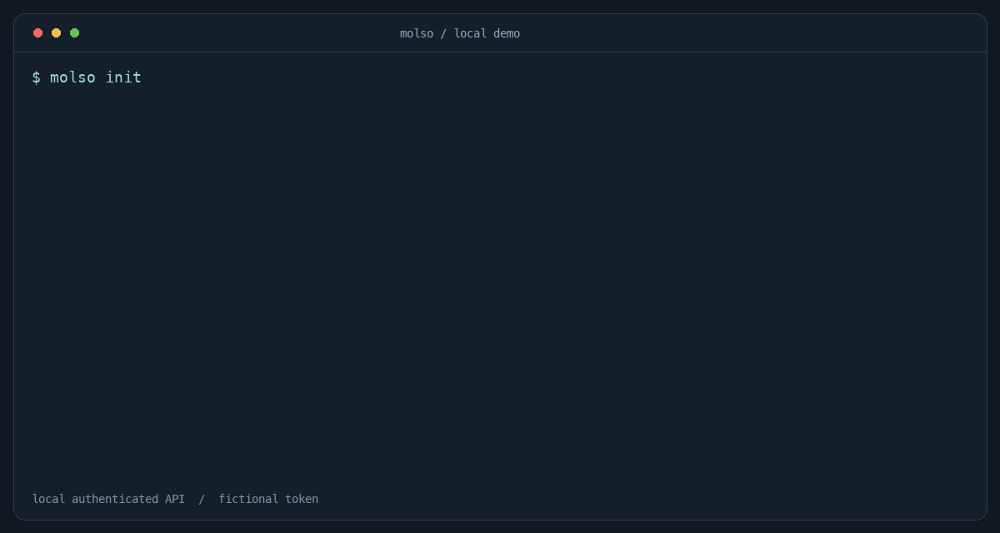

# molso — Password Manager CLI for AI Agents

[](https://github.com/HeimaoLST/molso/actions/workflows/ci.yml)
[](https://www.rust-lang.org/)
[](LICENSE)

molso is a local password manager written in Rust. An AI agent asks for a
credential by name; molso delivers it to a command through stdin or a child
environment variable. Passwords, API keys, and tokens stay out of the agent's
command arguments and normal molso output.

I built it because an agent's tool calls often become logs or model context.
The command that needs a token should receive it directly.

> 面向 AI Agent 的本地密码管理器。人录入凭据，agent 只使用名称；凭据通过 stdin 或子进程环境变量交付。



*Recorded from real CLI processes with a fictional credential. The demo consumer
compares the received bytes and reports the result; it does not contact a service.*

## Get started

You need [Rust](https://www.rust-lang.org/tools/install) **1.89+** to build.

```sh
git clone https://github.com/HeimaoLST/molso.git
cd molso
cargo install --path . --locked
```

Make sure Cargo's bin directory is on your PATH, then set up the store **in your
own terminal**:

```sh
molso init
molso put github/agent
molso list
```

`put` reads hidden input. Paste your token and press Enter. The name
`github/agent` is a label you choose: every name has two parts, `service/account`.

With [GitHub CLI](https://cli.github.com/) installed, the agent can now run:

```sh
molso exec --env GH_TOKEN=github/agent -- gh auth status
```

GitHub CLI supports [GH_TOKEN](https://cli.github.com/manual/gh_help_environment).
molso sets it only in the child process; your current shell is unchanged.
Choose a receiving command that does not print the token.

To try without installing, use `cargo build --release` and
`./target/release/molso` (Windows: `.\target\release\molso.exe`).

## Giving credentials to a command

Use the interface the receiving command supports:

| The command expects | Invocation |
| --- | --- |
| An environment variable | `molso exec --env GH_TOKEN=github/agent -- gh auth status` |
| Credential bytes on stdin | `molso exec --stdin service/account -- consumer` |
| A native shell pipeline | `molso get service/account \| consumer` |

`consumer` is your own executable. `exec --stdin` uses its stdin for the
credential, then closes it. Use `--env` if it also needs other input on stdin.
Repeat `--env` for several credentials.

The **`--` is required**. Everything after it belongs to the child, including
its `--help`. molso runs the executable directly, without starting a shell.

**Do not call `get` alone from an agent tool runner.** It refuses terminal
output, but a tool runner's non-terminal stdout can still be captured in logs.
Keep `get` and its consumer in one shell invocation, or use `exec`.
For byte-sensitive cross-platform delivery, prefer `exec --stdin`.

## Updating and importing

```sh
molso put github/agent --update
credential-source | molso put service/account --stdin
credential-source | molso put service/account --stdin --update
```

`credential-source` is a trusted producer you supply. Never put a literal
secret into an agent's tool call, even if that call pipes it to `put`.

Empty input fails before saving. For an intentional empty value, add
`--stdin --allow-empty`. Non-empty stdin is stored exactly, **including any
trailing newline**; molso does not trim it.

molso cannot see the producer's exit status. Empty output is rejected, but
partial output from a failing producer can still be stored. Check producer
success when importing; shell `pipefail` reports failures but cannot roll back
a completed write.

## Command reference

| Command | What it does |
| --- | --- |
| `init` | Create the key and encrypted vault; never overwrite existing files |
| `put service/account` | Add a credential; use `--update` to replace one |
| `list` | List names, sorted, without values |
| `get service/account` | Write exact bytes to a pipe, without an added newline |
| `remove service/account` | Delete an entry without prompting |
| `exec [OPTIONS] -- COMMAND [ARGS]` | Deliver credentials and pass through the child's exit code |

Run `molso help put` or `molso help exec` for examples.

## Where it stores things

The local data directory contains `key`, `vault`, and `vault.lock`:

| System | Default directory |
| --- | --- |
| macOS | `~/Library/Application Support/molso/` |
| Linux | `$XDG_DATA_HOME/molso/`, or `~/.local/share/molso/` |
| Windows | `%LOCALAPPDATA%\molso\` |

Override paths with `--vault PATH` / `--key-file PATH`, or `MOLSO_VAULT` /
`MOLSO_KEY_FILE`. These environment variables contain paths, not key material.
CLI options take precedence and work before or after a subcommand, up to
the `exec --` separator. Relative paths resolve against the current directory.

Back up **both the vault and its original key**. `init` cannot recover a lost
key. There is no unlock prompt: credential operations read the local key file.

## Security model

This is for **trusted, supervised agents**. Anyone who can read both the key
and vault can decrypt the credentials. A consumer's stdout and stderr are
forwarded, so that consumer must avoid printing secrets too.

The vault uses XChaCha20-Poly1305 with a random 32-byte key. New Unix files use
`0600` permissions and new directories use `0700`; Windows uses a protected
current-user DACL. File locks serialize updates, and values are saved through
same-directory replacement.

molso zeroizes sensitive buffers it owns. Copies in the OS, child environment,
and consumer are outside that guarantee. A successful delivery does not prove
authentication succeeded; check the consumer's own result. See the
[usage contract](docs/usage.md) for exit codes and durability boundaries.

## Development and platform status

```sh
cargo fmt --all --check
cargo clippy --all-targets --locked -- -D warnings
cargo test --locked
```

[CI](https://github.com/HeimaoLST/molso/actions/workflows/ci.yml) runs native
tests on macOS, Linux, and Windows. macOS also has local pseudo-terminal
coverage for hidden input. See the [validation record](docs/validation.md)
for completed checks and remaining Windows console and persistence coverage.

To reproduce the GIF on macOS or Linux, build the release binary and run
`scripts/record-demo.py` with Python and Pillow installed. It creates a
temporary store and records real process output; no personal credentials are used.

## More

- [Usage contract](docs/usage.md)
- [Validation record](docs/validation.md)
- [Usability notes](docs/usability.md)
- [Report a bug](https://github.com/HeimaoLST/molso/issues)

## License

[MIT](LICENSE) © 2026 HeimaoLST.
